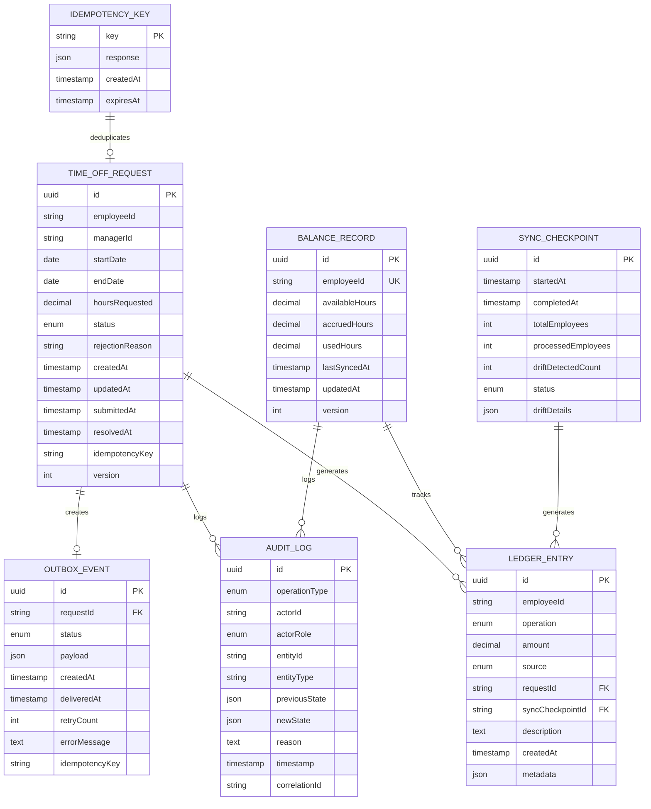
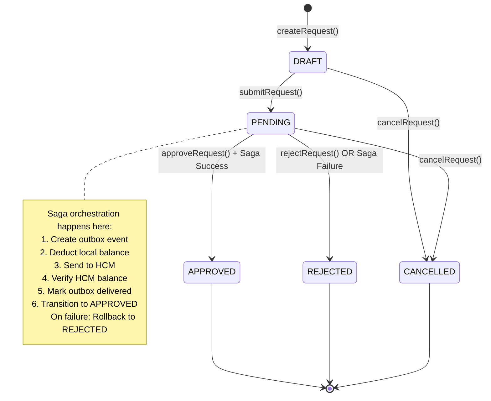
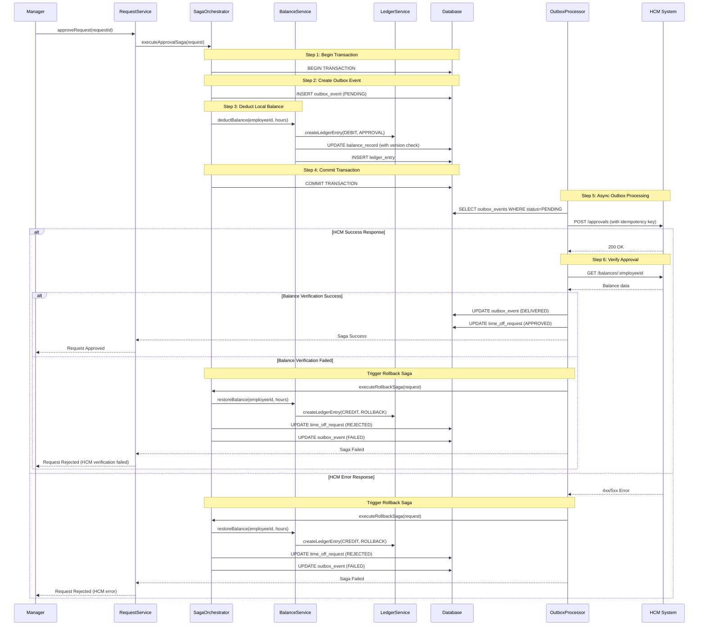
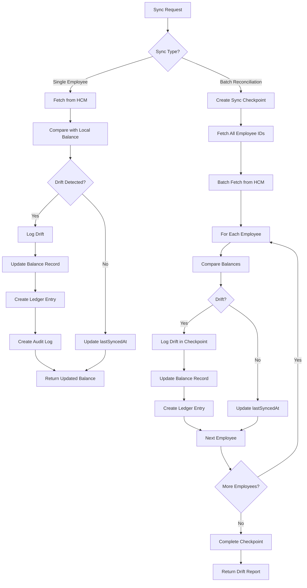
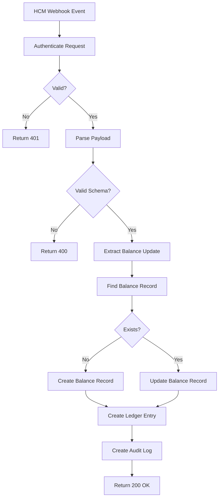

# Design Document: Time-Off Microservice

## Overview

The Time-Off Microservice is a NestJS-based backend service that manages employee time-off request lifecycles and maintains synchronized balance data with external Human Capital Management (HCM) systems. The service implements a hexagonal architecture (Ports & Adapters pattern) to isolate business logic from external dependencies, enabling testability and maintainability.

### Core Responsibilities

1. **Request Lifecycle Management**: Handle time-off requests through a state machine (DRAFT → PENDING → APPROVED/REJECTED/CANCELLED)
2. **Balance Synchronization**: Maintain cached employee balance data synchronized with HCM system of record
3. **Dual-Write Consistency**: Coordinate approvals between local state and HCM system using saga pattern with transactional outbox
4. **Audit & Compliance**: Maintain immutable audit trails and double-entry ledger for all balance mutations
5. **Graceful Degradation**: Serve cached data and queue operations during HCM outages

### Key Design Decisions

- **Hexagonal Architecture**: Separates core business logic from infrastructure concerns (database, HTTP, HCM client)
- **Saga Pattern**: Coordinates distributed transactions between Time-Off Service and HCM System with compensating actions
- **Transactional Outbox**: Ensures reliable message delivery to HCM system without distributed transactions
- **Double-Entry Ledger**: Provides complete audit trail and balance verification using accounting principles
- **Optimistic Locking**: Prevents race conditions on concurrent balance operations using database-level row versioning
- **Event Sourcing (Partial)**: Ledger entries and audit logs provide event history for balance reconstruction

### Technology Stack

- **Framework**: NestJS (TypeScript)
- **Database**: SQLite with TypeORM
- **Testing**: Jest with in-memory SQLite
- **Authentication**: JWT with role-based access control (RBAC)
- **API**: REST with OpenAPI documentation
- **Logging**: Structured JSON logs with correlation IDs

## Architecture

### Hexagonal Architecture (Ports & Adapters)

```
┌─────────────────────────────────────────────────────────────────┐
│                         HTTP Layer (Adapter)                     │
│  ┌──────────────┐  ┌──────────────┐  ┌──────────────┐          │
│  │   Balance    │  │   Request    │  │    Health    │          │
│  │  Controller  │  │  Controller  │  │  Controller  │          │
│  └──────────────┘  └──────────────┘  └──────────────┘          │
└─────────────────────────────────────────────────────────────────┘
                              │
                              ▼
┌─────────────────────────────────────────────────────────────────┐
│                      Application Layer (Ports)                   │
│  ┌──────────────┐  ┌──────────────┐  ┌──────────────┐          │
│  │   Balance    │  │   Request    │  │    Saga      │          │
│  │   Service    │  │   Service    │  │ Orchestrator │          │
│  └──────────────┘  └──────────────┘  └──────────────┘          │
│                                                                  │
│  ┌──────────────┐  ┌──────────────┐  ┌──────────────┐          │
│  │   Ledger     │  │    Audit     │  │   Outbox     │          │
│  │   Service    │  │   Service    │  │  Processor   │          │
│  └──────────────┘  └──────────────┘  └──────────────┘          │
└─────────────────────────────────────────────────────────────────┘
                              │
                              ▼
┌─────────────────────────────────────────────────────────────────┐
│                       Domain Layer (Core)                        │
│  ┌──────────────┐  ┌──────────────┐  ┌──────────────┐          │
│  │ TimeOffRequest│  │BalanceRecord │  │ LedgerEntry  │          │
│  │   Entity     │  │   Entity     │  │   Entity     │          │
│  └──────────────┘  └──────────────┘  └──────────────┘          │
│                                                                  │
│  ┌──────────────┐  ┌──────────────┐  ┌──────────────┐          │
│  │ RequestState │  │  ApprovalSaga│  │ IdempotencyKey│         │
│  │   Machine    │  │              │  │              │          │
│  └──────────────┘  └──────────────┘  └──────────────┘          │
└─────────────────────────────────────────────────────────────────┘
                              │
                              ▼
┌─────────────────────────────────────────────────────────────────┐
│                   Infrastructure Layer (Adapters)                │
│  ┌──────────────┐  ┌──────────────┐  ┌──────────────┐          │
│  │   TypeORM    │  │  HCM Client  │  │     JWT      │          │
│  │ Repositories │  │   Adapter    │  │   Strategy   │          │
│  └──────────────┘  └──────────────┘  └──────────────┘          │
└─────────────────────────────────────────────────────────────────┘
```

### Module Structure

```
src/
├── main.ts                          # Application entry point
├── app.module.ts                    # Root module
│
├── balance/                         # Balance domain module
│   ├── balance.module.ts
│   ├── balance.controller.ts        # HTTP adapter
│   ├── balance.service.ts           # Application service
│   ├── entities/
│   │   └── balance-record.entity.ts
│   └── repositories/
│       └── balance.repository.ts
│
├── request/                         # Request domain module
│   ├── request.module.ts
│   ├── request.controller.ts
│   ├── request.service.ts
│   ├── entities/
│   │   └── time-off-request.entity.ts
│   ├── state-machine/
│   │   └── request-state-machine.ts
│   └── repositories/
│       └── request.repository.ts
│
├── saga/                            # Saga orchestration module
│   ├── saga.module.ts
│   ├── approval-saga.orchestrator.ts
│   ├── outbox/
│   │   ├── outbox-event.entity.ts
│   │   ├── outbox.repository.ts
│   │   └── outbox.processor.ts
│   └── compensation/
│       └── rollback.handler.ts
│
├── ledger/                          # Ledger domain module
│   ├── ledger.module.ts
│   ├── ledger.service.ts
│   ├── entities/
│   │   └── ledger-entry.entity.ts
│   └── repositories/
│       └── ledger.repository.ts
│
├── audit/                           # Audit module
│   ├── audit.module.ts
│   ├── audit.service.ts
│   ├── entities/
│   │   └── audit-log.entity.ts
│   └── repositories/
│       └── audit.repository.ts
│
├── sync/                            # Synchronization module
│   ├── sync.module.ts
│   ├── sync.service.ts
│   ├── webhook.controller.ts
│   ├── reconciliation.service.ts
│   ├── entities/
│   │   └── sync-checkpoint.entity.ts
│   └── repositories/
│       └── sync.repository.ts
│
├── hcm/                             # HCM integration module
│   ├── hcm.module.ts
│   ├── hcm-client.interface.ts      # Port
│   ├── hcm-client.adapter.ts        # Adapter implementation
│   └── mock-hcm-server.ts           # Test double
│
├── auth/                            # Authentication module
│   ├── auth.module.ts
│   ├── jwt.strategy.ts
│   ├── roles.guard.ts
│   └── roles.decorator.ts
│
├── health/                          # Health check module
│   ├── health.module.ts
│   └── health.controller.ts
│
└── common/                          # Shared utilities
    ├── idempotency/
    │   ├── idempotency-key.entity.ts
    │   └── idempotency.service.ts
    ├── exceptions/
    │   └── custom-exceptions.ts
    └── interceptors/
        ├── logging.interceptor.ts
        └── correlation-id.interceptor.ts
```

## Components and Interfaces

### Core Domain Entities

#### TimeOffRequest Entity

```typescript
@Entity('time_off_requests')
export class TimeOffRequest {
  @PrimaryGeneratedColumn('uuid')
  id: string;

  @Column()
  employeeId: string;

  @Column()
  managerId: string;

  @Column('date')
  startDate: Date;

  @Column('date')
  endDate: Date;

  @Column('decimal', { precision: 10, scale: 2 })
  hoursRequested: number;

  @Column({
    type: 'varchar',
    enum: ['DRAFT', 'PENDING', 'APPROVED', 'REJECTED', 'CANCELLED']
  })
  status: RequestStatus;

  @Column({ nullable: true })
  rejectionReason?: string;

  @Column({ type: 'timestamp' })
  createdAt: Date;

  @Column({ type: 'timestamp' })
  updatedAt: Date;

  @Column({ nullable: true })
  submittedAt?: Date;

  @Column({ nullable: true })
  resolvedAt?: Date;

  @Column({ nullable: true })
  idempotencyKey?: string;

  @Version()
  version: number; // Optimistic locking
}

type RequestStatus = 'DRAFT' | 'PENDING' | 'APPROVED' | 'REJECTED' | 'CANCELLED';
```

#### BalanceRecord Entity

```typescript
@Entity('balance_records')
export class BalanceRecord {
  @PrimaryGeneratedColumn('uuid')
  id: string;

  @Column({ unique: true })
  employeeId: string;

  @Column('decimal', { precision: 10, scale: 2 })
  availableHours: number;

  @Column('decimal', { precision: 10, scale: 2 })
  accruedHours: number;

  @Column('decimal', { precision: 10, scale: 2 })
  usedHours: number;

  @Column({ type: 'timestamp' })
  lastSyncedAt: Date;

  @Column({ type: 'timestamp' })
  updatedAt: Date;

  @Version()
  version: number; // Optimistic locking for race condition prevention

  // Computed property
  get isStale(): boolean {
    const fiveMinutesAgo = new Date(Date.now() - 5 * 60 * 1000);
    return this.lastSyncedAt < fiveMinutesAgo;
  }
}
```

#### LedgerEntry Entity

```typescript
@Entity('ledger_entries')
export class LedgerEntry {
  @PrimaryGeneratedColumn('uuid')
  id: string;

  @Column()
  employeeId: string;

  @Column({
    type: 'varchar',
    enum: ['DEBIT', 'CREDIT']
  })
  operation: 'DEBIT' | 'CREDIT';

  @Column('decimal', { precision: 10, scale: 2 })
  amount: number;

  @Column({
    type: 'varchar',
    enum: ['APPROVAL', 'ROLLBACK', 'HCM_SYNC', 'WEBHOOK', 'RECONCILIATION']
  })
  source: LedgerSource;

  @Column({ nullable: true })
  requestId?: string;

  @Column({ nullable: true })
  syncCheckpointId?: string;

  @Column({ type: 'text', nullable: true })
  description?: string;

  @Column({ type: 'timestamp', default: () => 'CURRENT_TIMESTAMP' })
  createdAt: Date;

  @Column({ type: 'json', nullable: true })
  metadata?: Record<string, any>;
}

type LedgerSource = 'APPROVAL' | 'ROLLBACK' | 'HCM_SYNC' | 'WEBHOOK' | 'RECONCILIATION';
```

#### OutboxEvent Entity

```typescript
@Entity('outbox_events')
export class OutboxEvent {
  @PrimaryGeneratedColumn('uuid')
  id: string;

  @Column()
  requestId: string;

  @Column({
    type: 'varchar',
    enum: ['PENDING', 'DELIVERED', 'FAILED']
  })
  status: 'PENDING' | 'DELIVERED' | 'FAILED';

  @Column({ type: 'json' })
  payload: HCMApprovalPayload;

  @Column({ type: 'timestamp', default: () => 'CURRENT_TIMESTAMP' })
  createdAt: Date;

  @Column({ type: 'timestamp', nullable: true })
  deliveredAt?: Date;

  @Column({ type: 'int', default: 0 })
  retryCount: number;

  @Column({ type: 'text', nullable: true })
  errorMessage?: string;

  @Column({ nullable: true })
  idempotencyKey?: string;
}

interface HCMApprovalPayload {
  employeeId: string;
  startDate: string;
  endDate: string;
  hoursRequested: number;
  requestId: string;
}
```

#### AuditLog Entity

```typescript
@Entity('audit_logs')
export class AuditLog {
  @PrimaryGeneratedColumn('uuid')
  id: string;

  @Column({
    type: 'varchar',
    enum: [
      'REQUEST_CREATED', 'REQUEST_SUBMITTED', 'REQUEST_APPROVED',
      'REQUEST_REJECTED', 'REQUEST_CANCELLED', 'BALANCE_UPDATED',
      'SAGA_STARTED', 'SAGA_COMPLETED', 'SAGA_FAILED', 'SAGA_ROLLED_BACK'
    ]
  })
  operationType: AuditOperationType;

  @Column()
  actorId: string;

  @Column({
    type: 'varchar',
    enum: ['EMPLOYEE', 'MANAGER', 'ADMIN', 'SYSTEM']
  })
  actorRole: string;

  @Column({ nullable: true })
  entityId?: string;

  @Column({ nullable: true })
  entityType?: string;

  @Column({ type: 'json', nullable: true })
  previousState?: Record<string, any>;

  @Column({ type: 'json', nullable: true })
  newState?: Record<string, any>;

  @Column({ type: 'text', nullable: true })
  reason?: string;

  @Column({ type: 'timestamp', default: () => 'CURRENT_TIMESTAMP' })
  timestamp: Date;

  @Column({ nullable: true })
  correlationId?: string;
}

type AuditOperationType =
  | 'REQUEST_CREATED' | 'REQUEST_SUBMITTED' | 'REQUEST_APPROVED'
  | 'REQUEST_REJECTED' | 'REQUEST_CANCELLED' | 'BALANCE_UPDATED'
  | 'SAGA_STARTED' | 'SAGA_COMPLETED' | 'SAGA_FAILED' | 'SAGA_ROLLED_BACK';
```

#### SyncCheckpoint Entity

```typescript
@Entity('sync_checkpoints')
export class SyncCheckpoint {
  @PrimaryGeneratedColumn('uuid')
  id: string;

  @Column({ type: 'timestamp', default: () => 'CURRENT_TIMESTAMP' })
  startedAt: Date;

  @Column({ type: 'timestamp', nullable: true })
  completedAt?: Date;

  @Column({ type: 'int' })
  totalEmployees: number;

  @Column({ type: 'int', default: 0 })
  processedEmployees: number;

  @Column({ type: 'int', default: 0 })
  driftDetectedCount: number;

  @Column({
    type: 'varchar',
    enum: ['IN_PROGRESS', 'COMPLETED', 'FAILED']
  })
  status: 'IN_PROGRESS' | 'COMPLETED' | 'FAILED';

  @Column({ type: 'json', nullable: true })
  driftDetails?: Array<{
    employeeId: string;
    localBalance: number;
    hcmBalance: number;
    difference: number;
  }>;
}
```

#### IdempotencyKey Entity

```typescript
@Entity('idempotency_keys')
export class IdempotencyKey {
  @PrimaryColumn()
  key: string;

  @Column({ type: 'json' })
  response: any;

  @Column({ type: 'timestamp', default: () => 'CURRENT_TIMESTAMP' })
  createdAt: Date;

  @Column({ type: 'timestamp' })
  expiresAt: Date; // 24 hours from creation
}
```

### Port Interfaces

#### HCM Client Port

```typescript
export interface IHCMClient {
  /**
   * Fetch current balance for an employee from HCM system
   */
  fetchBalance(employeeId: string): Promise<HCMBalanceResponse>;

  /**
   * Submit approval to HCM system
   */
  submitApproval(payload: HCMApprovalPayload, idempotencyKey: string): Promise<HCMApprovalResponse>;

  /**
   * Verify approval was processed by fetching updated balance
   */
  verifyApproval(employeeId: string, expectedDeduction: number): Promise<boolean>;

  /**
   * Fetch balances for multiple employees (batch operation)
   */
  fetchBalancesBatch(employeeIds: string[]): Promise<Map<string, HCMBalanceResponse>>;

  /**
   * Check HCM system health
   */
  healthCheck(): Promise<boolean>;
}

interface HCMBalanceResponse {
  employeeId: string;
  availableHours: number;
  accruedHours: number;
  usedHours: number;
  asOfDate: Date;
}

interface HCMApprovalResponse {
  success: boolean;
  requestId: string;
  message?: string;
  errorCode?: string;
}
```

### Service Interfaces

#### Request Service

```typescript
export interface IRequestService {
  createRequest(dto: CreateRequestDto, actorId: string): Promise<TimeOffRequest>;
  getRequest(requestId: string, actorId: string): Promise<TimeOffRequest>;
  updateRequest(requestId: string, dto: UpdateRequestDto, actorId: string): Promise<TimeOffRequest>;
  submitRequest(requestId: string, actorId: string): Promise<TimeOffRequest>;
  approveRequest(requestId: string, managerId: string): Promise<TimeOffRequest>;
  rejectRequest(requestId: string, managerId: string, reason: string): Promise<TimeOffRequest>;
  cancelRequest(requestId: string, actorId: string): Promise<TimeOffRequest>;
  listRequests(filters: RequestFilters, actorId: string): Promise<PaginatedResult<TimeOffRequest>>;
}
```

#### Balance Service

```typescript
export interface IBalanceService {
  getBalance(employeeId: string): Promise<BalanceRecord>;
  syncBalance(employeeId: string): Promise<BalanceRecord>;
  updateBalanceFromHCM(employeeId: string, hcmData: HCMBalanceResponse): Promise<BalanceRecord>;
  deductBalance(employeeId: string, hours: number, requestId: string): Promise<BalanceRecord>;
  restoreBalance(employeeId: string, hours: number, requestId: string): Promise<BalanceRecord>;
  getLedgerHistory(employeeId: string, filters: LedgerFilters): Promise<LedgerEntry[]>;
}
```

#### Saga Orchestrator

```typescript
export interface ISagaOrchestrator {
  executeApprovalSaga(request: TimeOffRequest, managerId: string): Promise<SagaResult>;
  executeRollbackSaga(request: TimeOffRequest, reason: string): Promise<void>;
}

interface SagaResult {
  success: boolean;
  finalStatus: RequestStatus;
  errorMessage?: string;
}
```

## Data Models

### Entity Relationship Diagram



### State Machine Diagram



### Approval Saga Sequence Diagram



### Balance Synchronization Flow



### Webhook Processing Flow



## Correctness Properties

*A property is a characteristic or behavior that should hold true across all valid executions of a system—essentially, a formal statement about what the system should do. Properties serve as the bridge between human-readable specifications and machine-verifiable correctness guarantees.*

### Property 1: State Machine Transitions Are Always Valid

**Formal Statement:** For any `TimeOffRequest` in state `S`, applying transition `T` either produces a valid next state or throws an error — it never silently produces an invalid state.

**Valid Transition Table:**
```
DRAFT      → PENDING    (submit)
DRAFT      → CANCELLED  (cancel)
PENDING    → APPROVED   (approve + saga success)
PENDING    → REJECTED   (reject OR saga failure)
PENDING    → CANCELLED  (cancel)
```

**Invalid Transitions (must throw):**
- APPROVED → any state
- REJECTED → any state
- CANCELLED → any state
- DRAFT → APPROVED (skipping PENDING)
- PENDING → DRAFT (backwards)

**Property-Based Test:**
```typescript
// For all (currentStatus, targetStatus) pairs not in the valid table,
// attempting the transition must throw InvalidStateTransitionException.
// For all valid pairs, the transition must succeed and persist the new status.
property('state machine rejects all invalid transitions', fc.record({
  from: fc.constantFrom('DRAFT', 'PENDING', 'APPROVED', 'REJECTED', 'CANCELLED'),
  to:   fc.constantFrom('DRAFT', 'PENDING', 'APPROVED', 'REJECTED', 'CANCELLED'),
}), ({ from, to }) => {
  const isValid = VALID_TRANSITIONS[from]?.includes(to) ?? false;
  if (!isValid) {
    expect(() => stateMachine.transition(from, to)).toThrow(InvalidStateTransitionException);
  }
});
```

**Validates:** Requirements 1.7, 1.8

---

### Property 2: Balance Invariant — Available = Accrued − Used

**Formal Statement:** At all times, for every `BalanceRecord`, `availableHours === accruedHours − usedHours`. This must hold after every operation that modifies the balance.

**Property-Based Test:**
```typescript
property('balance invariant holds after any sequence of operations', fc.array(
  fc.oneof(
    fc.record({ type: fc.constant('ACCRUE'), hours: fc.float({ min: 0.5, max: 40 }) }),
    fc.record({ type: fc.constant('DEDUCT'), hours: fc.float({ min: 0.5, max: 40 }) }),
    fc.record({ type: fc.constant('RESTORE'), hours: fc.float({ min: 0.5, max: 40 }) }),
  )
), async (operations) => {
  let balance = await createBalanceRecord(40, 0); // 40 accrued, 0 used
  for (const op of operations) {
    try { await applyOperation(balance, op); } catch { /* insufficient balance is ok */ }
    balance = await repo.findOne(balance.id);
    expect(balance.availableHours).toBeCloseTo(balance.accruedHours - balance.usedHours, 2);
  }
});
```

**Validates:** Requirements 2.4, 7.7, 9.7

---

### Property 3: Double-Entry Ledger Always Balances

**Formal Statement:** For any employee, the sum of all CREDIT ledger entries minus the sum of all DEBIT ledger entries equals the current `availableHours` in the `BalanceRecord`.

```
SUM(ledger.amount WHERE operation='CREDIT') − SUM(ledger.amount WHERE operation='DEBIT') = balance.availableHours
```

**Property-Based Test:**
```typescript
property('ledger net sum equals current balance for any sequence of mutations', fc.array(
  fc.record({
    operation: fc.constantFrom('DEBIT', 'CREDIT'),
    amount: fc.float({ min: 0.25, max: 20 }),
    source: fc.constantFrom('APPROVAL', 'ROLLBACK', 'HCM_SYNC', 'WEBHOOK'),
  })
), async (entries) => {
  const employeeId = uuid();
  await seedBalance(employeeId, 100);
  for (const e of entries) {
    try { await ledgerService.createEntry({ employeeId, ...e }); } catch {}
  }
  const ledgerEntries = await ledgerRepo.findByEmployee(employeeId);
  const credits = ledgerEntries.filter(e => e.operation === 'CREDIT').reduce((s, e) => s + e.amount, 0);
  const debits  = ledgerEntries.filter(e => e.operation === 'DEBIT').reduce((s, e) => s + e.amount, 0);
  const balance = await balanceRepo.findByEmployee(employeeId);
  expect(credits - debits).toBeCloseTo(balance.availableHours, 2);
});
```

**Validates:** Requirement 7.7

---

### Property 4: Balance Operations Are Atomic and Consistent

**Formal Statement:** A balance deduction and its corresponding ledger entry are always created together or not at all. There is never a state where the balance is deducted but no ledger entry exists, or a ledger entry exists but the balance was not updated.

**Property-Based Test:**
```typescript
property('deductBalance always creates exactly one DEBIT ledger entry', fc.record({
  hours: fc.float({ min: 0.5, max: 10 }),
}), async ({ hours }) => {
  const employeeId = uuid();
  await seedBalance(employeeId, 20);
  const requestId = uuid();
  const ledgerBefore = await ledgerRepo.countByEmployee(employeeId);
  await balanceService.deductBalance(employeeId, hours, requestId);
  const ledgerAfter = await ledgerRepo.countByEmployee(employeeId);
  expect(ledgerAfter).toBe(ledgerBefore + 1);
  const entry = await ledgerRepo.findLatestByEmployee(employeeId);
  expect(entry.operation).toBe('DEBIT');
  expect(entry.amount).toBeCloseTo(hours, 2);
  expect(entry.requestId).toBe(requestId);
});
```

**Validates:** Requirements 2.3, 3.2, 9.1

---

### Property 5: Saga Maintains Eventual Consistency

**Formal Statement:** After any saga execution (success or failure), the system reaches one of exactly two consistent states:
- **Approved state**: `request.status === 'APPROVED'` AND HCM reflects the deduction AND local balance is reduced AND outbox event is DELIVERED
- **Rejected state**: `request.status === 'REJECTED'` AND HCM does NOT reflect the deduction AND local balance is restored AND outbox event is FAILED

There is no intermediate or inconsistent state after saga completion.

**Property-Based Test:**
```typescript
property('saga always terminates in a consistent approved or rejected state', fc.record({
  hcmFaultMode: fc.constantFrom('NONE', 'ERROR_500', 'TIMEOUT', 'SILENT_200'),
  hoursRequested: fc.float({ min: 1, max: 8 }),
}), async ({ hcmFaultMode, hoursRequested }) => {
  mockHcm.setFaultMode(hcmFaultMode);
  const { request, balanceBefore } = await setupApprovalScenario(hoursRequested);
  await sagaOrchestrator.executeApprovalSaga(request, managerId);
  const finalRequest = await requestRepo.findOne(request.id);
  const finalBalance = await balanceRepo.findByEmployee(request.employeeId);
  const outboxEvent  = await outboxRepo.findByRequestId(request.id);

  if (finalRequest.status === 'APPROVED') {
    expect(outboxEvent.status).toBe('DELIVERED');
    expect(finalBalance.availableHours).toBeCloseTo(balanceBefore - hoursRequested, 2);
  } else {
    expect(finalRequest.status).toBe('REJECTED');
    expect(outboxEvent.status).toBe('FAILED');
    expect(finalBalance.availableHours).toBeCloseTo(balanceBefore, 2); // fully restored
  }
});
```

**Validates:** Requirement 3.9

---

### Property 6: Outbox Events Are Processed At-Least-Once

**Formal Statement:** Every `OutboxEvent` created with status `PENDING` will eventually be processed (transitioned to `DELIVERED` or `FAILED`). No `PENDING` event remains unprocessed indefinitely.

**Property-Based Test:**
```typescript
property('all pending outbox events are processed within max retry window', fc.array(
  fc.record({ faultMode: fc.constantFrom('NONE', 'ERROR_500', 'TIMEOUT') }),
  { minLength: 1, maxLength: 10 }
), async (scenarios) => {
  const events = await Promise.all(scenarios.map(s => createPendingOutboxEvent(s.faultMode)));
  await outboxProcessor.processAll(); // runs full retry cycle
  for (const event of events) {
    const processed = await outboxRepo.findOne(event.id);
    expect(['DELIVERED', 'FAILED']).toContain(processed.status);
    expect(processed.status).not.toBe('PENDING');
  }
});
```

**Validates:** Requirements 16.8, 16.9

---

### Property 7: Idempotent Operations Produce Consistent Results

**Formal Statement:** For any state-changing operation `O` with idempotency key `K`, executing `O` once and executing `O` multiple times with the same `K` produce identical observable outcomes. The second and subsequent calls return the same response as the first without additional side effects.

**Property-Based Test:**
```typescript
property('repeated requests with same idempotency key produce no additional mutations', fc.record({
  key: fc.uuid(),
  repeatCount: fc.integer({ min: 2, max: 5 }),
}), async ({ key, repeatCount }) => {
  const dto = buildCreateRequestDto();
  const responses: TimeOffRequest[] = [];
  for (let i = 0; i < repeatCount; i++) {
    responses.push(await requestService.createRequest(dto, actorId, key));
  }
  // All responses must be identical
  expect(new Set(responses.map(r => r.id)).size).toBe(1);
  // Only one request should exist in the database
  const count = await requestRepo.countByIdempotencyKey(key);
  expect(count).toBe(1);
});
```

**Validates:** Requirement 4.6

---

### Property 8: Reconciliation Converges to HCM Truth

**Formal Statement:** After a batch reconciliation completes, for every employee, the local `BalanceRecord.availableHours` equals the HCM system's reported balance. No drift remains after reconciliation.

**Property-Based Test:**
```typescript
property('after reconciliation, all local balances match HCM balances', fc.array(
  fc.record({
    employeeId: fc.uuid(),
    localBalance: fc.float({ min: 0, max: 100 }),
    hcmBalance: fc.float({ min: 0, max: 100 }),
  }),
  { minLength: 1, maxLength: 50 }
), async (employees) => {
  await seedLocalBalances(employees.map(e => ({ id: e.employeeId, hours: e.localBalance })));
  mockHcm.seedBalances(employees.map(e => ({ id: e.employeeId, hours: e.hcmBalance })));
  await syncService.runBatchReconciliation();
  for (const emp of employees) {
    const local = await balanceRepo.findByEmployee(emp.employeeId);
    expect(local.availableHours).toBeCloseTo(emp.hcmBalance, 2);
  }
});
```

**Validates:** Requirements 6.7, 2.7

---

### Property 9: API Endpoints Enforce Consistent Access Control

**Formal Statement:** For every protected endpoint, a request without a valid JWT returns 401. A request with a valid JWT but insufficient role returns 403. Only requests with the correct role succeed.

**Property-Based Test:**
```typescript
property('access control is enforced consistently across all protected endpoints', fc.record({
  endpoint: fc.constantFrom(...PROTECTED_ENDPOINTS),
  role: fc.constantFrom('NONE', 'EMPLOYEE', 'MANAGER', 'ADMIN'),
}), async ({ endpoint, role }) => {
  const token = role === 'NONE' ? null : generateToken(role);
  const response = await makeRequest(endpoint, token);
  if (role === 'NONE') {
    expect(response.status).toBe(401);
  } else if (!ALLOWED_ROLES[endpoint.method + endpoint.path].includes(role)) {
    expect(response.status).toBe(403);
  } else {
    expect(response.status).not.toBeOneOf([401, 403]);
  }
});
```

**Validates:** Requirements 14.1–14.8

---

### Property 10: Invalid Requests Consistently Return 400

**Formal Statement:** Any request with invalid input (bad dates, negative hours, missing required fields, overlapping dates) always returns HTTP 400 with a descriptive error message. No invalid request ever succeeds or causes a 500 error.

**Property-Based Test:**
```typescript
property('invalid create-request payloads always return 400', fc.oneof(
  // Invalid date range: end before start
  fc.record({ startDate: fc.date(), endDate: fc.date() }).filter(d => d.endDate < d.startDate),
  // Negative hours
  fc.record({ hoursRequested: fc.float({ max: -0.01 }) }),
  // Missing required fields
  fc.record({ employeeId: fc.constant(undefined) }),
), async (invalidPayload) => {
  const response = await request(app.getHttpServer())
    .post('/requests')
    .set('Authorization', `Bearer ${employeeToken}`)
    .send(invalidPayload);
  expect(response.status).toBe(400);
  expect(response.body).toHaveProperty('message');
  expect(typeof response.body.message).toBe('string');
  expect(response.body.message.length).toBeGreaterThan(0);
});
```

**Validates:** Requirements 18.1–18.7

---

### Property 11: Health Status Accurately Reflects System State

**Formal Statement:** The `/health/ready` endpoint returns `200` if and only if both the database connection and HCM system are reachable. It returns a non-200 status if either dependency is unavailable.

**Property-Based Test:**
```typescript
property('health endpoint status matches actual dependency availability', fc.record({
  dbAvailable: fc.boolean(),
  hcmAvailable: fc.boolean(),
}), async ({ dbAvailable, hcmAvailable }) => {
  if (!dbAvailable) await simulateDbOutage();
  if (!hcmAvailable) mockHcm.setFaultMode('TIMEOUT');
  const response = await request(app.getHttpServer()).get('/health/ready');
  if (dbAvailable && hcmAvailable) {
    expect(response.status).toBe(200);
  } else {
    expect(response.status).not.toBe(200);
  }
  await restoreDb();
  mockHcm.setFaultMode('NONE');
});
```

**Validates:** Requirements 13.4, 13.5

---

### Property 12: Missing Required Configuration Causes Startup Failure

**Formal Statement:** If any required environment variable is absent at startup, the application must throw a descriptive error and exit. It must never start in a partially-configured state.

**Property-Based Test:**
```typescript
property('application fails to start when any required env var is missing', fc.subarray(
  REQUIRED_ENV_VARS, { minLength: 1 }
), async (missingVars) => {
  const env = { ...FULL_ENV };
  for (const v of missingVars) delete env[v];
  await expect(bootstrapApp(env)).rejects.toThrow(/missing.*configuration|required.*environment/i);
});
```

**Validates:** Requirement 20.7

---

## API Specification

### Base URL
```
/api/v1
```

### Authentication
All endpoints (except `/health/*`) require:
```
Authorization: Bearer <JWT>
```

JWT payload shape:
```typescript
interface JwtPayload {
  sub: string;        // actorId (UUID)
  role: 'EMPLOYEE' | 'MANAGER' | 'ADMIN';
  iat: number;
  exp: number;
}
```

### Balance Endpoints

| Method | Path | Role | Description |
|--------|------|------|-------------|
| GET | `/balances/:employeeId` | EMPLOYEE (own), MANAGER, ADMIN | Get current balance with staleness indicator |
| GET | `/balances/:employeeId/ledger` | EMPLOYEE (own), MANAGER, ADMIN | Get full ledger history |
| POST | `/balances/:employeeId/sync` | MANAGER, ADMIN | Trigger on-demand HCM sync |
| POST | `/balances/webhook` | SYSTEM (HCM) | Receive HCM push event |
| POST | `/balances/sync/batch` | ADMIN | Trigger full batch reconciliation |

**GET /balances/:employeeId — Response:**
```typescript
{
  employeeId: string;
  availableHours: number;
  accruedHours: number;
  usedHours: number;
  lastSyncedAt: string;       // ISO-8601
  isStale: boolean;
  staleSince?: string;        // ISO-8601, present when isStale=true
}
```

### Time-Off Request Endpoints

| Method | Path | Role | Description |
|--------|------|------|-------------|
| POST | `/requests` | EMPLOYEE | Create DRAFT request |
| GET | `/requests` | EMPLOYEE (own), MANAGER, ADMIN | List with filters + pagination |
| GET | `/requests/:id` | EMPLOYEE (own), MANAGER, ADMIN | Get single request |
| PATCH | `/requests/:id` | EMPLOYEE (own, DRAFT only) | Update DRAFT request |
| POST | `/requests/:id/submit` | EMPLOYEE (own) | DRAFT → PENDING |
| POST | `/requests/:id/approve` | MANAGER, ADMIN | PENDING → saga → APPROVED |
| POST | `/requests/:id/reject` | MANAGER, ADMIN | PENDING → REJECTED |
| POST | `/requests/:id/cancel` | EMPLOYEE (own), MANAGER, ADMIN | → CANCELLED |

**POST /requests — Request Body:**
```typescript
{
  employeeId: string;         // UUID
  startDate: string;          // YYYY-MM-DD
  endDate: string;            // YYYY-MM-DD
  hoursRequested: number;     // positive decimal
  type: 'VACATION' | 'SICK' | 'PERSONAL';
  notes?: string;             // max 500 chars
}
```

**POST /requests — 201 Response:**
```typescript
{
  id: string;
  status: 'DRAFT';
  employeeId: string;
  startDate: string;
  endDate: string;
  hoursRequested: number;
  availableBalance: number;
  createdAt: string;
}
```

**Error Response Envelope:**
```typescript
{
  statusCode: number;
  error: string;              // e.g. 'INSUFFICIENT_BALANCE', 'INVALID_TRANSITION'
  message: string;
  requestId: string;
  timestamp: string;
}
```

### Health Endpoints

| Method | Path | Auth | Description |
|--------|------|------|-------------|
| GET | `/health` | None | Overall status |
| GET | `/health/live` | None | Liveness probe |
| GET | `/health/ready` | None | Readiness probe (DB + HCM) |

**GET /health/ready — Response:**
```typescript
{
  status: 'ok' | 'degraded' | 'down';
  database: { status: 'up' | 'down'; latencyMs: number };
  hcm: { status: 'up' | 'down'; latencyMs: number };
  outboxQueueDepth: number;
  timestamp: string;
}
```

---

## Algorithms and Key Implementation Details

### Approval Saga — Pseudocode

```
function executeApprovalSaga(request, managerId):
  // Phase 1: Local atomic commit
  BEGIN TRANSACTION
    outboxEvent = INSERT outbox_events { requestId, status: PENDING, payload, idempotencyKey }
    ledgerEntry = INSERT ledger_entries { employeeId, operation: DEBIT, amount, source: APPROVAL, requestId }
    UPDATE balance_records SET availableHours -= amount, version += 1 WHERE employeeId AND version = currentVersion
    IF optimistic lock conflict: ROLLBACK; THROW ConcurrentModificationException
    UPDATE time_off_requests SET status = HCM_SUBMITTING WHERE id = request.id
    INSERT audit_logs { operationType: SAGA_STARTED, actorId: managerId, entityId: request.id }
  COMMIT TRANSACTION

  // Phase 2: Async outbox processing (runs on scheduler every 5s)
  LOOP:
    pendingEvents = SELECT * FROM outbox_events WHERE status = PENDING ORDER BY createdAt
    FOR EACH event:
      TRY:
        hcmResponse = POST hcm/approvals WITH idempotencyKey (timeout: 5s)
        IF hcmResponse.success:
          hcmBalance = GET hcm/balances/:employeeId (timeout: 5s)
          expectedBalance = localBalance - event.payload.hoursRequested
          IF abs(hcmBalance - expectedBalance) > DRIFT_THRESHOLD:
            THROW HcmVerificationFailedException
          UPDATE outbox_events SET status = DELIVERED
          UPDATE time_off_requests SET status = APPROVED
          INSERT audit_logs { operationType: SAGA_COMPLETED }
        ELSE:
          THROW HcmRejectionException(hcmResponse.errorCode)
      CATCH (any error after maxRetries=5):
        executeRollbackSaga(event.requestId, error.message)

function executeRollbackSaga(requestId, reason):
  BEGIN TRANSACTION
    INSERT ledger_entries { operation: CREDIT, source: ROLLBACK, requestId }
    UPDATE balance_records SET availableHours += amount, version += 1
    UPDATE time_off_requests SET status = HCM_FAILED
    UPDATE outbox_events SET status = FAILED, errorMessage = reason
    INSERT audit_logs { operationType: SAGA_ROLLED_BACK }
  COMMIT TRANSACTION
```

### Exponential Backoff — Retry Schedule

```
Attempt 1: immediate
Attempt 2: wait 1s
Attempt 3: wait 2s
Attempt 4: wait 4s
Attempt 5: wait 8s
After attempt 5: mark FAILED, trigger rollback, alert ops
```

### Batch Reconciliation — Pseudocode

```
function runBatchReconciliation():
  checkpoint = INSERT sync_checkpoints { status: IN_PROGRESS, startedAt: now() }
  employeeIds = SELECT DISTINCT employeeId FROM balance_records
  checkpoint.totalEmployees = employeeIds.length

  // Process in parallel batches of 100
  FOR EACH batch OF 100 employees:
    hcmBalances = GET hcm/balances/batch { employeeIds: batch }  // single HCM call
    FOR EACH employeeId IN batch:
      local = SELECT * FROM balance_records WHERE employeeId
      hcm   = hcmBalances[employeeId]
      drift = abs(local.availableHours - hcm.availableHours)
      IF drift > DRIFT_THRESHOLD (default: 0.1):
        delta = hcm.availableHours - local.availableHours
        operation = delta > 0 ? CREDIT : DEBIT
        BEGIN TRANSACTION
          INSERT ledger_entries { operation, amount: abs(delta), source: RECONCILIATION, syncCheckpointId }
          UPDATE balance_records SET availableHours = hcm.availableHours, lastSyncedAt = now()
        COMMIT
        checkpoint.driftDetectedCount++
        checkpoint.driftDetails.push({ employeeId, localBalance, hcmBalance, difference: delta })
      ELSE:
        UPDATE balance_records SET lastSyncedAt = now()
      checkpoint.processedEmployees++

  UPDATE sync_checkpoints SET status = COMPLETED, completedAt = now()
  RETURN checkpoint
```

### Idempotency — Request Deduplication

```
function withIdempotency(key, operation):
  IF key is null: RETURN operation()   // no idempotency requested

  existing = SELECT * FROM idempotency_keys WHERE key = key AND expiresAt > now()
  IF existing: RETURN existing.response   // cache hit — return stored response

  result = operation()   // execute the actual operation

  INSERT idempotency_keys {
    key,
    response: result,
    createdAt: now(),
    expiresAt: now() + 24h
  }
  RETURN result
```

---

## Error Handling Strategy

### Exception Hierarchy

```typescript
class TimeOffException extends Error {
  constructor(public readonly code: string, message: string) { super(message); }
}

class InvalidStateTransitionException extends TimeOffException {}  // 409
class InsufficientBalanceException extends TimeOffException {}     // 422
class HcmUnavailableException extends TimeOffException {}          // 503
class HcmVerificationFailedException extends TimeOffException {}   // 502
class ConcurrentModificationException extends TimeOffException {}  // 409
class IdempotencyConflictException extends TimeOffException {}     // 409
class EntityNotFoundException extends TimeOffException {}          // 404
```

### Global Exception Filter

All exceptions are caught by a NestJS `ExceptionFilter` that maps them to the standard error envelope:

```typescript
{
  statusCode: number,
  error: string,       // exception code
  message: string,
  requestId: string,   // from correlation-id interceptor
  timestamp: string
}
```

---

## Security Design

### JWT Validation
- Algorithm: RS256 (asymmetric) in production; HS256 acceptable for development
- Claims validated: `exp`, `iat`, `sub`, `role`
- Invalid/expired tokens → 401

### HCM Webhook Authentication
- HMAC-SHA256 signature on request body using shared secret
- Signature passed in `X-HCM-Signature` header
- Requests without valid signature → 401

### Role-Based Access Control

| Role | Permissions |
|------|-------------|
| EMPLOYEE | Create/view/cancel own requests; view own balance |
| MANAGER | All EMPLOYEE permissions on team; approve/reject team requests; view team balances |
| ADMIN | All operations; batch sync; reconciliation; audit log access |
| SYSTEM | Webhook ingestion; batch sync trigger |

---

## Performance Design

### Database Indexes

```sql
-- Balance lookups (hot path, p99 < 50ms target)
CREATE INDEX idx_balance_employee ON balance_records(employeeId);

-- Request queries
CREATE INDEX idx_request_employee_status ON time_off_requests(employeeId, status);
CREATE INDEX idx_request_dates ON time_off_requests(startDate, endDate);

-- Outbox processing (runs every 5s)
CREATE INDEX idx_outbox_status_created ON outbox_events(status, createdAt);

-- Ledger queries
CREATE INDEX idx_ledger_employee_created ON ledger_entries(employeeId, createdAt);

-- Audit queries
CREATE INDEX idx_audit_entity ON audit_logs(entityId, entityType);
CREATE INDEX idx_audit_actor ON audit_logs(actorId, timestamp);

-- Idempotency lookups
CREATE INDEX idx_idempotency_expires ON idempotency_keys(expiresAt);
```

### Caching Strategy
- Balance reads served from local SQLite (no HCM call on hot path)
- Staleness threshold: 5 minutes (configurable via `BALANCE_STALE_THRESHOLD_MS`)
- HCM availability cached for 30 seconds to avoid thundering herd on outage detection

